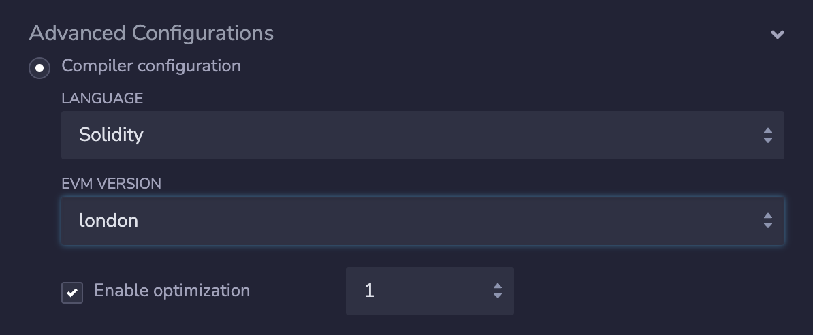

# Mnist Contracts Tutorial


This is part 3 of our tutorial on building the [e2e-mnist](https://e2e-mnist.vercel.app) demo app where we over the development of the mnist clan contract. Check out the contract code [here](https://goerli-optimism.etherscan.io/address/0xf5cDCD333E3Fd09929BAcEa32c2c1E3A5A746d45#code)

The minst clan contract stores the hand drawn digits of user accounts and makes calls to the on-chain evm verifier of the corresponding digit recognition model to validate the submitted digit. 

## Developing MnistClan.sol

**1. Verifier Contract Interface:** The contract leverages an external Verifier contract to verify the proof submitted by users. The Verifier contract interface has one function - **`verifyProof`** - which takes public inputs and a proof as parameters and returns a boolean indicating whether the proof is valid.

```solidity
// SPDX-License-Identifier: MIT
pragma solidity ^0.8.13;

interface Verifier {
    function verifyProof(
        bytes calldata proof,
        uint256[] calldata instances
    ) external returns (bool);
}
```

**2. Constants and State Variables:** 
-   Verifier Reference: The contract holds a reference to the Verifier contract, which is set at the time of contract deployment.
-   Constants and Mappings:
    -   ORDER: The order of the [prime field](https://0xparc.org/blog/zk-pairing-2#:~:text=Although%20our%20circuits%20target%20the%20BLS12%2D381%20curve%2C%20they%20can%20be%20easily%20adapted%20to%20other%20curves.%20We%20have%20recently%20modified%20our%20circuits%20to%20work%20for%20the%20BN254%20curve%2C%20which%20Ethereum%20supports%20with%20precompiles%20for%20elliptic%20curve%20arithmetic%20and%20pairings.%20This%20used%20the%20following%20modifications%3A) EZKL uses.
    -   THRESHOLD: Used to in the feltToInt function for determing the cut off when a field element goes from being represented as a positive integer to a negative integer.
    -   Mappings:
        -   entered: Tracks whether an account has already submitted a digit.
        -   clan: Maps an account to its chosen digit.
        -   counts: Keeps track of submissions for each digit.

```solidity
contract MnistClan {
    // The admin address in charge of updating the to new verifier each new cycle.

    Verifier public verifier;

    /**
     * @notice EZKL P value
     * @dev In order to prevent the verifier from accepting two version of the same pubInput, n and the quantity (n + P),  where n + P <= 2^256, we require that all instances are stricly less than P. a
     * @dev The reason for this is that the assmebly code of the verifier performs all arithmetic operations modulo P and as a consequence can't distinguish between n and n + P.
     */
    uint256 constant ORDER = 0x30644e72e131a029b85045b68181585d2833e84879b9709143e1f593f0000001;

    uint256 private constant THRESHOLD = uint128(type(int128).max);

    // Keeps track of whether an account has already entered a digit.
    mapping(address => bool) public entered;
    // Accounts clan
    mapping(address => uint8) public clan;
    // Keeps track of the number of submissions for each digit.
    mapping(uint8 => uint256) public counts;

    constructor(Verifier _verifier) {
        verifier = _verifier;
    }
```

**3. Core Functions** 
-   submitDigit
    -   Purpose: Allows users to submit a digit classification along with a proof.
    -   Process:
        -   Ensures one submission per account.
        -   Validates the proof using the Verifier.
        -   Determines the digit with the max value from the instances using feltToInt.
            - We need to do this because some of the outputs of the model can be negative.
        -   Updates the `entered` and `clan` mappings.
        -   Increments the count of submissions for the submitted digit.

```solidity
    function submitDigit(
        bytes calldata proof,
        uint256[] calldata instances
    ) public {
        // One submission per account
        require(!entered[msg.sender]);

        // Verify EZKL proof.
        require(verifier.verifyProof(proof, instances));

        // retrieve the index with the max value
        uint256 maxIndex = 0;
        int256 maxValue = feltToInt(instances[0]);

        for (uint256 i = 1; i < instances.length; i++) {
            int256 adjustedValue = feltToInt(instances[i]);
            if (adjustedValue > maxValue) {
                maxValue = adjustedValue;
                maxIndex = i;
            }
        }
        // update the entered mapping
        entered[msg.sender] = true;
        // update clan mapping
        clan[msg.sender] = uint8(maxIndex);

        // Update the counts mapping (this should be safe since instances length will always be == 10)
        uint256 count = ++counts[uint8(maxIndex)];
        counts[uint8(maxIndex)] = count;
    }
```

-   feltToInt
    -   Purpose: Converts a field element to an integer.
    -   Process:
        -   If the field element is less than the threshold, it is returned as is.
        -   Otherwise, the field element is subtracted from the prime field order and the result is returned.

```solidity
    function feltToInt(uint256 value) private pure returns (int256) {
        if (value > THRESHOLD) {
            return int256(value) - int256(ORDER);
        } else {
            return int256(value);
        }
    }
```

-   getCounts
    -   Purpose: Getter function for returning the contents of the `counts` mapping. 
    -   Use Case: Makes getting the clan counts easier on the frontend as we don't have to call on the mapping iteratively.

```solidity
    function getCounts() public view returns (uint256[10] memory) {
        uint256[10] memory countsArray;
        for (uint8 i = 0; i < 10; i++) {
            countsArray[i] = counts[i];
        }
        return countsArray;
    }
}
```

## Deploying the contracts

**1. Download Solidity Verifier from Hub** 

- The verifier contract is available on the [EZKL Hub](https://app.ezkl.xyz) and can be downloaded by clicking the 'Download Verifier' button on the artifact's page.

**2. Adjust compiler settings.** 

- Setting EVM Version: As you prepare to deploy the verifier and crypto idol contracts, it is critical to set the Ethereum Virtual Machine (EVM) version to a configuration that's compatible with layer 2 blockchains. Our testing has shown the 'London' version to be most compatible. For this tutorial we'll use the [Remix](https://remix.ethereum.org/) IDE to deploy our contracts. To modify the EVM version to `London`, navigate to the `Advanced Configurations` tab and select `London` from the `EVM Version` dropdown list. Neglecting to make this adjustment might result in unsuccessful deployment of your verifier Solidity code, often manifesting as a 'push0 not a valid opcode' error.

- Enabling Optimizations: In the `Compiler` tab, make sure `Enable optimization` is checked and the dropdown is set to `1`.



**3. Deployment**

- You need deploy the verifier contract first. As you will need to pass the address of the deployed verifier to the `Mnist Clan` contract’s constructor. Click the page icon next to the ‘x’ on the deployed verifier instance to copy its address, then paste it into the _verifier deploy param of MnistClassifier.sol.
