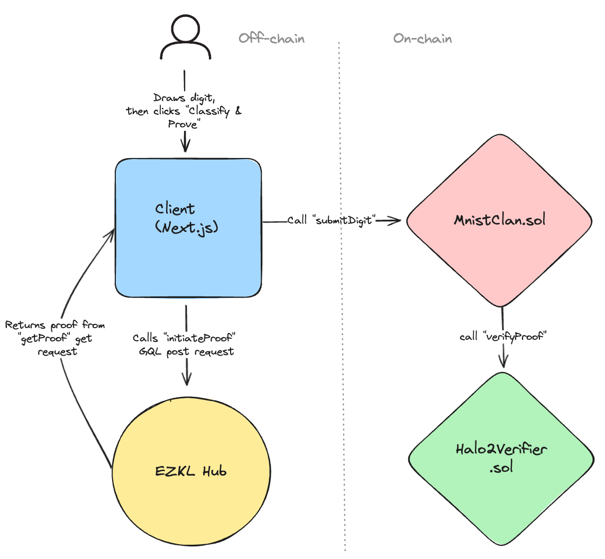

# Overview

# **Building a Digit Recognition Classifier and Verifier with PyTorch, EZKL Hub and Next.js**

This is part 1 of our tutorial on building the [MNIST-Clansifier](https://e2e-mnist.vercel.app/) demo app.The entire app is open source which you can view on Github; check out the model [here](https://github.com/zkonduit/e2e-mnist/blob/main/mnist_classifier.ipynb), the frontend [here](https://github.com/zkonduit/e2e-mnist) and the smart contract [here](https://goerli-optimism.etherscan.io/address/0xf5cDCD333E3Fd09929BAcEa32c2c1E3A5A746d45#code)

## **Introduction**

In this tutorial, we will demonstrate an end-to-end tutorial that showcases how to train a model for handrawn digit recognition, use the EZKL hub to deploy the model, build a smart contract that interfaces with the an EVM verifier and a front end that calls on the hub for delegated proving. 

The proofs get submitted to a contract that assigns the users account to a digit clan (0-9). The contract keeps track of the member count of each clan. The clan with the most members is the winner!

This application is a good faith fork of the first ZKML application built by [horacepan](https://horacepan.github.io/), [sunfishstanford](https://github.com/sunfishstanford) and [henripal](https://github.com/henripal) as part of 0xPARC's winter 2021 applied zk learning group. You can find the original app [here](https://zkmnist.netlify.app/) and source code [here](https://github.com/0xZKML/zk-mnist). This is the project that inspired the creaton of EZKL and we are excited to replicate and gamify it :).

## **Data Preparation and Training**

-   Dataset Loading: PyTorch's torchvision.datasets.MNIST to load the MNIST dataset of handwritten digits.
-   Normalize Data: normalize_img to set all pixel values to binary (0 or 1), mimicking input data from the drawing interface we will build.
-   Data Pipeline: Employs DataLoader for batching (256 images per batch) for both training and testing datasets.

## **Training Process**

-   Model Building: Uses the LeNet model defined in PyTorch with convolutional and fully connected layers.
-   Model Configuration: The model is adapted to the appropriate device (GPU/CPU), using Adam optimizer and CrossEntropyLoss function.
-   Training Loop: Runs for 25 epochs, including forward pass, loss calculation, and backpropagation, with model accuracy evaluated after each epoch.
-   Exporting: Exports the PyTorch model to ONNX format and exports a sample dataset in JSON format

## **Deploying to EZKL Hub**

-   Proving Service: EZKL Hub, a backend proving service, simplifies the process of generating and managing zk-specific artifacts.
-   Deployment Steps: Includes initializing EZKL run args, gathering calibration data, deploying the model using create_hub_artifact, and testing proofs on the hub.

## **EVM Verifier Deployment and Verification**

-   Verifier Contract: The verifier contract is deployed on the Goerli testnet using the Optimism L2 network.
-   Proof Verification: We use the EZKL hub to fetch a proof on the client side and then submit it for on chain for verification.

## **Frontend and JS Binding**

- Tensor Preparation: Converts the drawn digit into a tensor for processing.
- Digit Classification: Analyzes the drawn digit and displays the prediction result from the `proof.instances` output.
- Proof Generation: Utilizes `hub.initiatProof` and `hub.getProof` for proving that the model classified a given digit.
- Smart Contract Integration: Uses wagmi's public provider and specifies the contract's ABI and address for on-chain verification.
